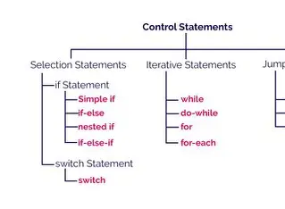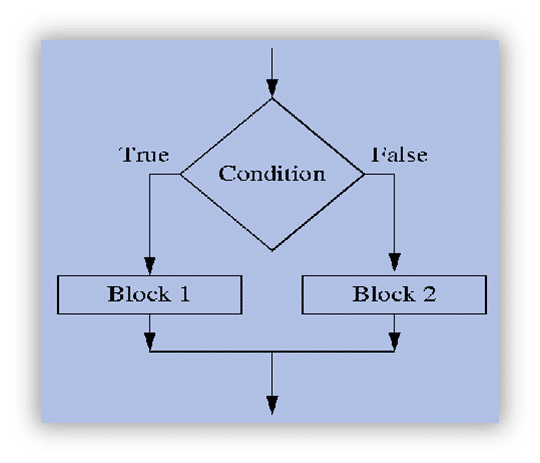

## Controller Statements
### Decision Making statements 
* if statement 
* switch statement
### looping  statement 
* do while loop
* while loop 
* for loop 
* for each loop
### Jump Statement 
* break 
* continues 


#### if statement
* simple if statement 
* if-else statement 
* if-else-if statement 
* nested if statement 
* 


---

# Java Naming Conventions

Java naming conventions are standardized ways to name variables, classes, methods, packages, and other programming elements. Following naming conventions makes code more readable and maintainable.

---

## Table of Contents

* [1. Packages](#1-packages)
* [2. Classes and Interfaces](#2-classes-and-interfaces)
* [3. Methods](#3-methods)
* [4. Variables](#4-variables)
* [5. Constants](#5-constants)
* [6. Enums](#6-enums)
* [7. Type Parameters](#7-type-parameters)
* [8. Test Classes and Methods](#8-test-classes-and-methods)
* [9. Miscellaneous Tips](#9-miscellaneous-tips)

---

## 1. Packages

* **Convention**: All lowercase, use reversed domain name.
* **Separator**: Dot (`.`)
* **Examples**:

  ```java
  com.techmahajan.myapp
  org.example.utility
  ```

---

## 2. Classes and Interfaces

* **Convention**: PascalCase (each word starts with uppercase)
* **Nouns** for classes, **Adjectives or Nouns** for interfaces
* **Examples**:

  ```java
  public class EmployeeService { }
  public interface Printable { }
  ```

---

## 3. Methods

* **Convention**: camelCase (starts with lowercase, internal words start with uppercase)
* **Verb-noun** or action-oriented
* **Examples**:

  ```java
  public void calculateSalary() { }
  public String getName() { }
  ```

---

## 4. Variables

* **Convention**: camelCase
* **Nouns** representing the purpose
* **Examples**:

  ```java
  int age;
  String employeeName;
  List<String> emailList;
  ```

---

## 5. Constants

* **Convention**: UPPER\_CASE with underscores between words
* **Modifiers**: `public static final`
* **Examples**:

  ```java
  public static final int MAX_USERS = 100;
  public static final String DB_URL = "jdbc:mysql://localhost:3306/mydb";
  ```

---

## 6. Enums

* **Enum Types**: PascalCase
* **Enum Constants**: UPPER\_CASE
* **Examples**:

  ```java
  public enum Status {
      ACTIVE,
      INACTIVE,
      PENDING
  }
  ```

---

## 7. Type Parameters

* **Convention**: Single uppercase letters
* **Common Letters**:

    * `T` – Type
    * `E` – Element
    * `K` – Key
    * `V` – Value
* **Example**:

  ```java
  public class Box<T> {
      private T value;
  }
  ```

---

## 8. Test Classes and Methods

* **Class Naming**: `[ClassName]Test`
* **Method Naming**: `test[MethodName]` or `should[Behavior]_When_[Condition]`
* **Examples**:

  ```java
  public class UserServiceTest {
      @Test
      public void shouldReturnUser_WhenIdIsValid() { }
  }
  ```

---

## 9. Miscellaneous Tips

| Item                  | Convention Example           |
| --------------------- | ---------------------------- |
| Boolean variables     | `isEnabled`, `hasPermission` |
| Getter/Setter methods | `getName()`, `setName()`     |
| Temporary variables   | `temp`, `buffer`, `index`    |
| Loop index            | `i`, `j`, `k`                |

---

## Summary Table

| Element        | Case Style     | Example            |
| -------------- | -------------- | ------------------ |
| Package        | lowercase      | `com.tech.mahajan` |
| Class          | PascalCase     | `EmployeeManager`  |
| Interface      | PascalCase     | `Serializable`     |
| Method         | camelCase      | `calculateTotal()` |
| Variable       | camelCase      | `employeeList`     |
| Constant       | UPPER\_CASE    | `MAX_LIMIT`        |
| Enum Type      | PascalCase     | `DayOfWeek`        |
| Enum Constant  | UPPER\_CASE    | `SUNDAY`           |
| Type Parameter | Single Capital | `T`, `E`, `K`, `V` |

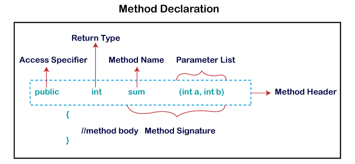

### Methods 
#### 2 category 
* predefined method: println(); etc..
* user-defined method: calculateSalary();etc.
#### methods type:
* non-static
*  static 
*  abstract 
*  default
  
## OOPS
1) Data Hiding
2) Abstraction
3) Encapsulation
4) Tightly Encapsulated Class
5) IS-A Relationship
6) HAS-A Relationship
7) Method Signature
8) Overloading
9) Overriding
10) Method Hiding
11) Static Control Flow
12) Instance Control Flow
13) Constructors
14) Coupling
15) Cohesion
16) Object Type Casting

## interface
 1.regular interface
 2.marker interface(Cloneable,Serializable,Remote,etc)
 3.functional interface

 
## Array in java 
1-10 

int a=1;
int b=2;
.
.
.
.
int x=10;
4*10;
40byte
1000

int number[]= new int[10];
0-1
1-2
.
.
.
9-10


syntax: 
datatype arrayname[]= new datatype[size];
0 10-1

### Types of array
 #### single dimensional array
##### different way of array declaration 
* datatype arrayname[];
* dataypte[] arrayname;
* datatype []arrayname;
* datatype [] arrayname;
##### initialization of array
 * arrayname= new datatype[size]
 * datatype []arrayname = new datatype[size];
 * datatype []arrayname={element1,element2,.,.}
 #### multi dimensional array 
##### different way of array declaration
* datatype arrayname[];
* dataypte[][] arrayname;
* datatype[] []arrayname;
* datatype [] []arrayname;
##### initialization of array
* arrayname= new datatype[size]
* datatype [][]arrayname = new datatype[size][size];
* datatype [][]arrayname={{element1,element2,.,.},{}}
## jagged array 
### declaration 
   datatype array[][];
### initialization
    new datatype[size][];

## Arrays util class
 * this class is available  in java.util package 

## Customer Feedback Analyzer 

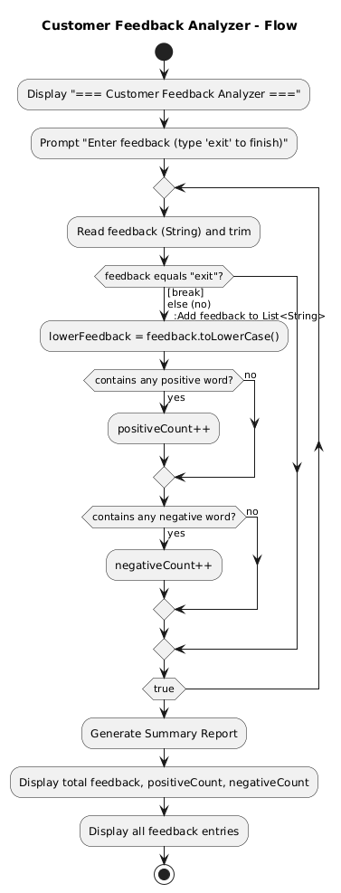
## StringBuffer 
  this is the class 
  is used to create mutable string object 
  String s= new String("this my string ")
  String s1= new String();

### constructor of StringBuffer 
1.  StringBuffer();//intial capacity 16
2.  StringBuffer(String str)
3.  StringBuffer(int capacity)
### methods
1. append(String s);
2. insert(int offset,String s)
3. replace(int startinginde,int endindex,String s)
4. delete(int startinginde,int endindex)
5. reverse()
6. capacity()
7. charAt(int index)
8. lenght()
9. substring(int begindex)
10. substring(int startinginde,int endindex)


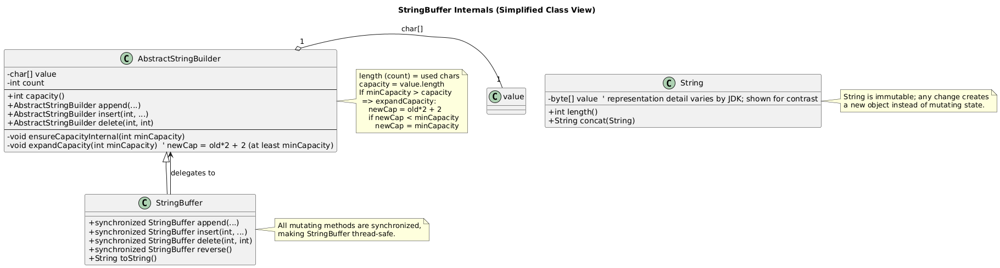
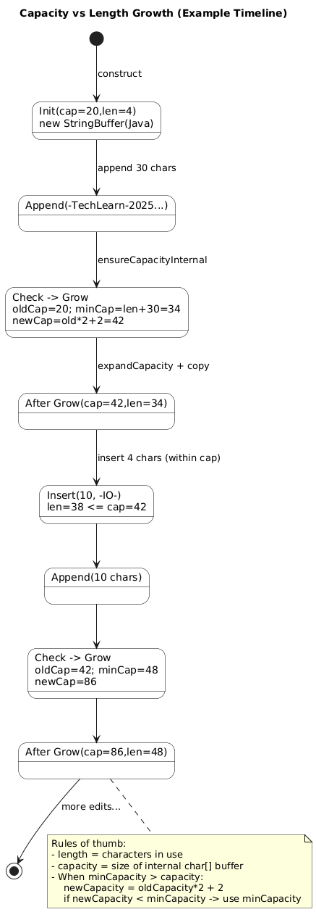
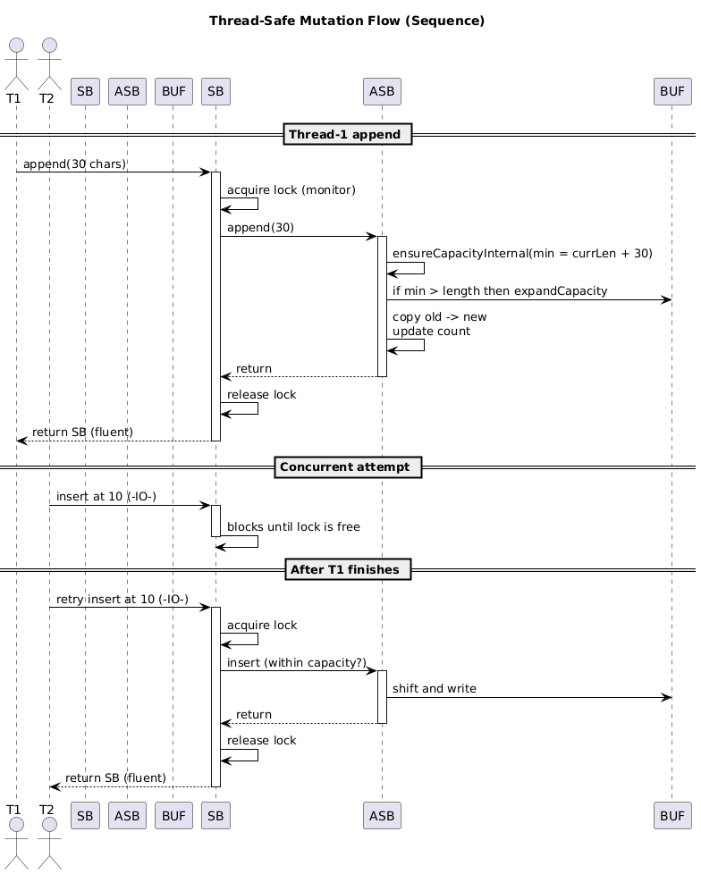

## StringBuilder 
1. this is the class.
2. it used to create mutable string like StringBuffer.
3. why we required StringBuilder if we have already StringBuffer.
    because StringBuffer all methods are synchronized but StringBuilder has not synchronized. 
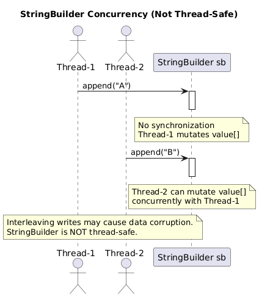
### constructor of StringBuffer
1.  StringBuilder();//intial capacity 16
2.  StringBuilder(String str)
3.  StringBuilder(int capacity)


| Feature           | String (Immutable)                | StringBuffer (Mutable, Sync)   | StringBuilder (Mutable, Non-Sync)              |
| ----------------- | --------------------------------- |--------------------------------|------------------------------------------------|
| **Mutability**    | ❌ No                              | ✅ Yes                          | ✅ Yes                                          |
| **Thread-Safe**   | ✅ Yes                             | ✅ Yes (synchronized)           | ❌ No                                           |
| **Performance**   | Slow (new object for each change) | Slower (sync overhead)         | Fastest (no sync)                              |
| **Memory Usage**  | High (creates new objects)        | Efficient (reuses same object) | Efficient (reuses same object)                 |
| **Best Use Case** | Constants, fixed text             | Multi-threaded application     | Single-threaded application, JSON/XML building |

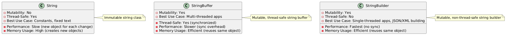
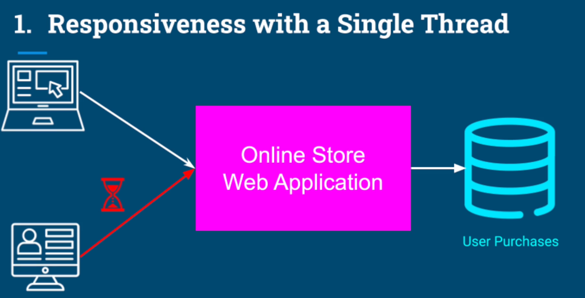
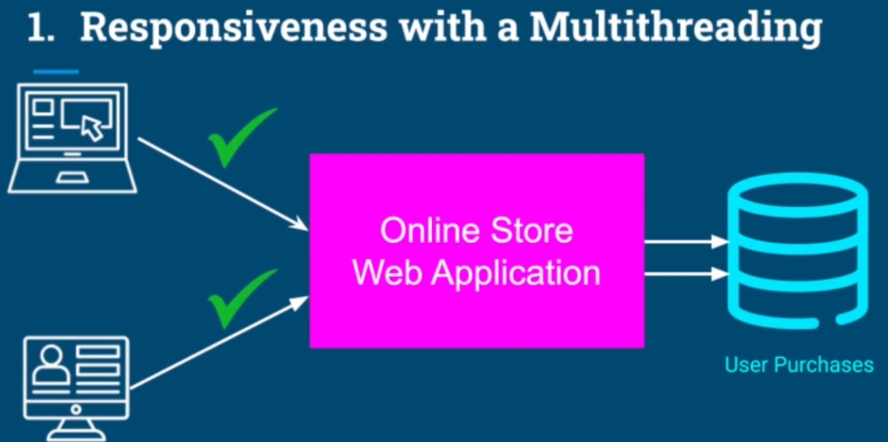
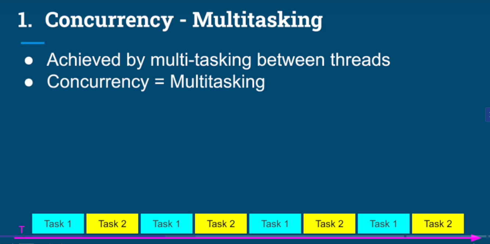
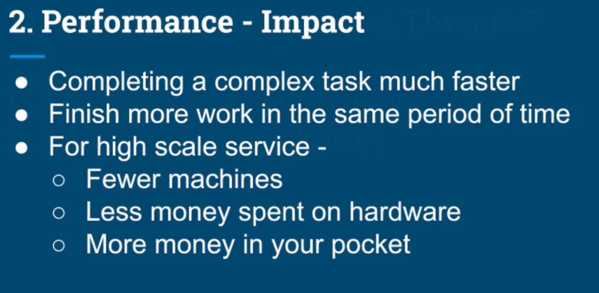
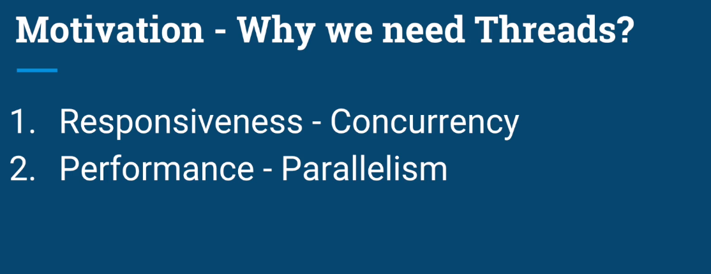
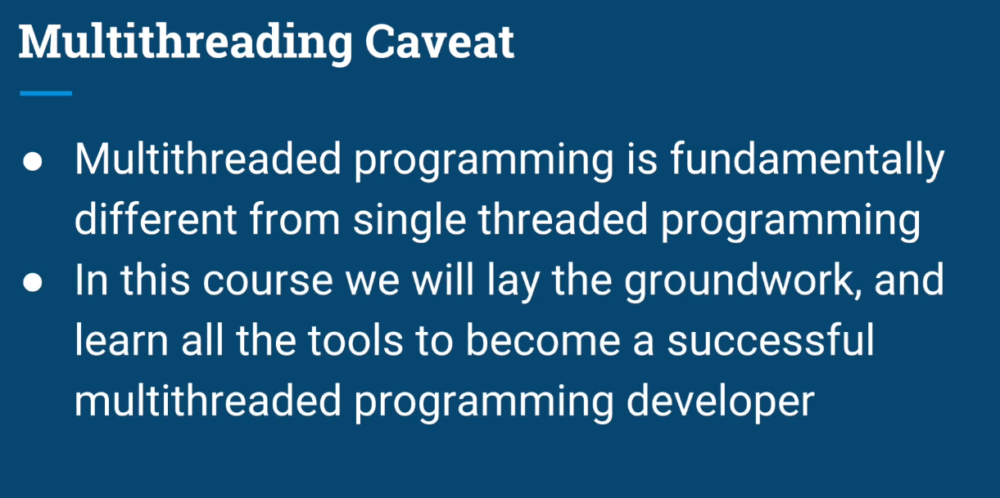
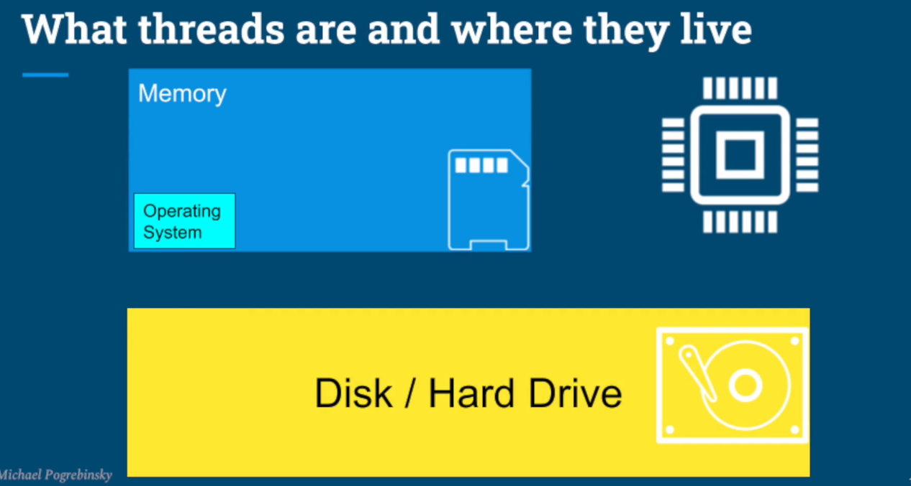
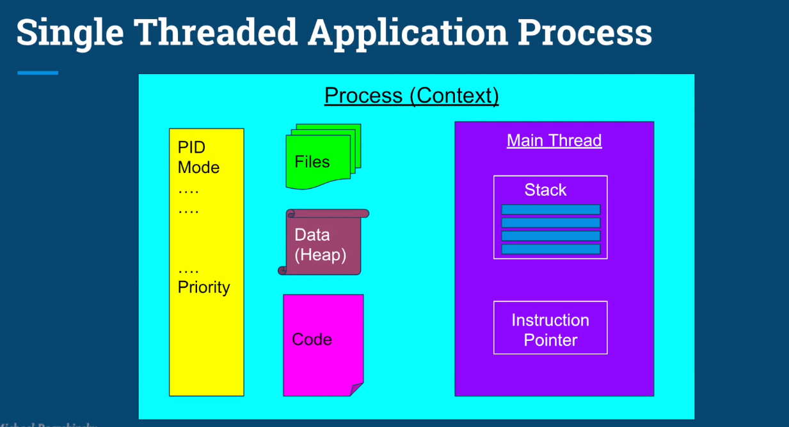
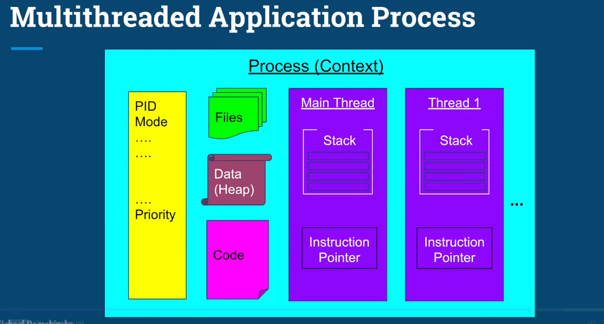
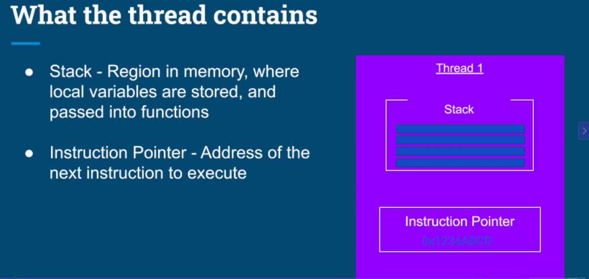
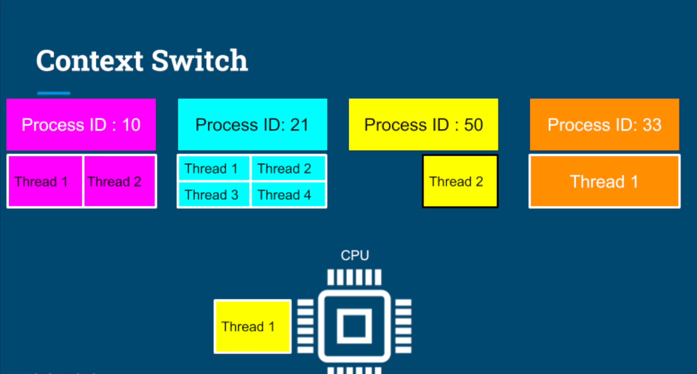
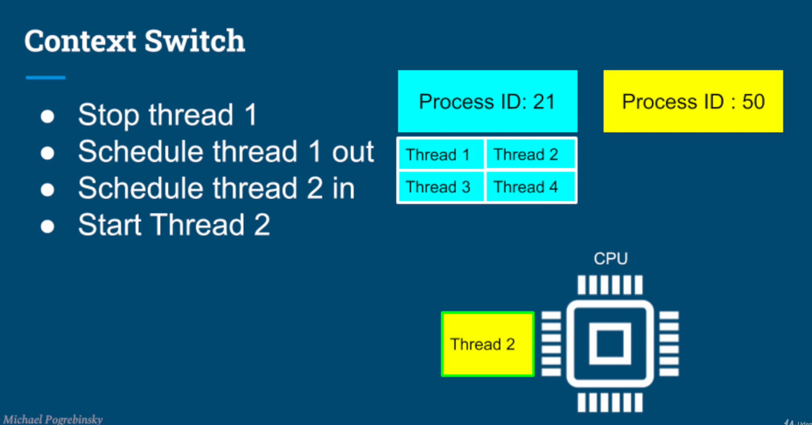
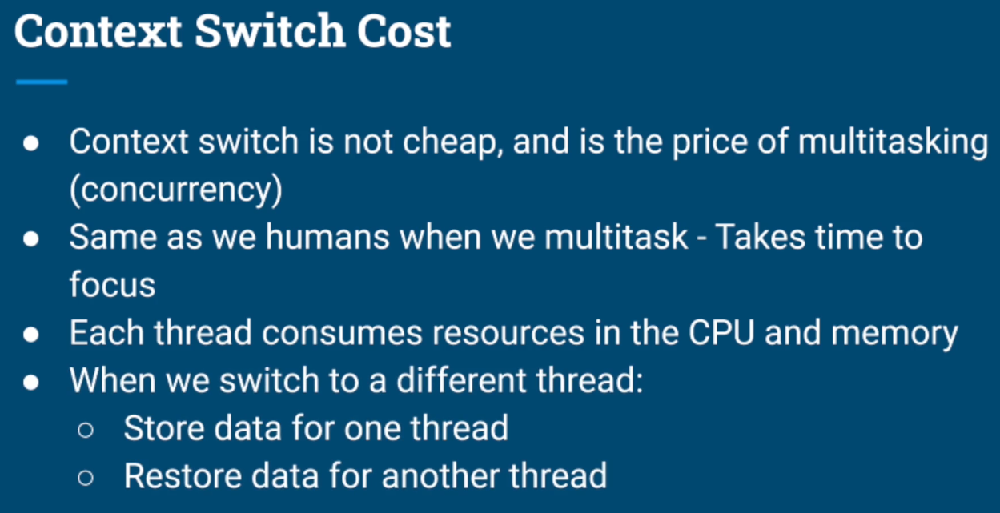

## Two way we can implements or Achieve the multithreading in java 
1. Thread class : by extending Thread class we can achieve the multithreading 
2. Runnable interface: by implementing Runnable interface we can achieve the multithreading 

## Deadlock
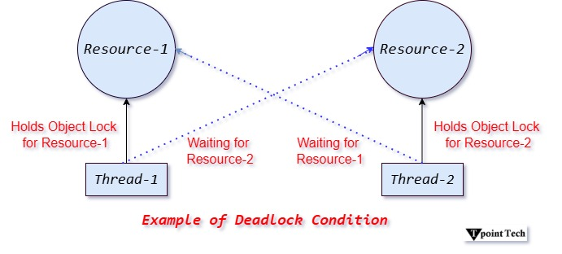

## Collection Framework
 ### Iterable --interface - super parent
#### Collection --interface - parent child of Iterable interface 
##### List -- interface - child of collection
#### Set -- interface -child of collection
##### SortedSet--inteface  -child set 
#### Queue --interface - child of collection
##### Deque --interface  - child Queue

 #### ArrayList
#### LinkedList

#### Vector
#### Stack


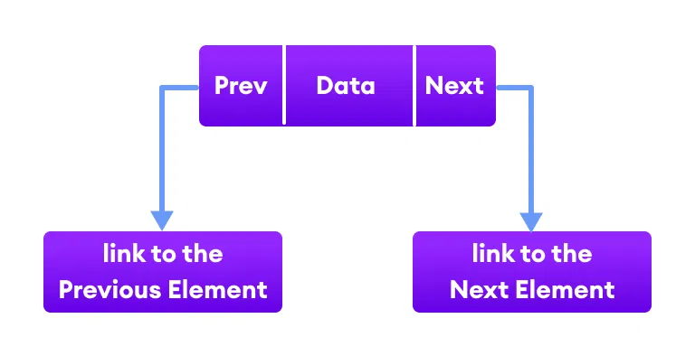

Working of a Java LinkedList
Elements in linked lists are not stored in sequence. Instead, they are scattered and connected through links (Prev and Next).

3 linkedlist nodes each connecting to one another using pointers

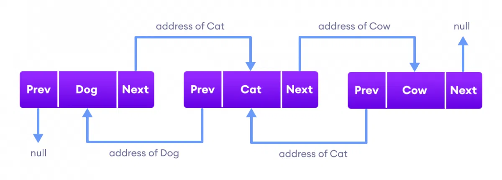
LinkedList Vs. ArrayList
Both the Java ArrayList and LinkedList implements the List interface of the Collections framework. However, there exists some difference between them.

LinkedList	ArrayList
Implements List, Queue, and Deque interfaces.	Implements List interface.
Stores 3 values (previous address, data, and next address) in a single position.	Stores a single value in a single position.
Provides the doubly-linked list implementation.	Provides a resizable array implementation.
Whenever an element is added, prev and next address are changed.	Whenever an element is added, all elements after that position are shifted.
To access an element, we need to iterate from the beginning to the element.	Can randomly access elements using indexes.